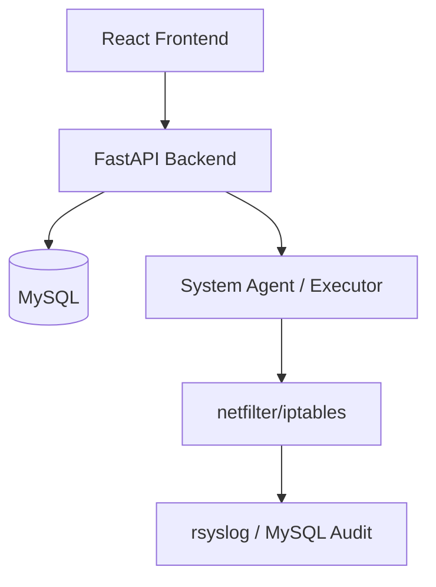

# Security Layer - Architecture Specification

## 1. Executive Summary
The platform is an enterprise-grade Firewall Management System designed for Ubuntu LTS, managing `iptables` (netfilter) via a secure REST API and a React-based frontend. It prioritizes auditability, versioning, and fail-safe operations.

## 2. Technical Stack
- **OS**: Ubuntu 24.04 LTS
- **Backend**: FastAPI (Python) - chosen for its performance, type safety, and excellent OpenAPI integration.
- **Frontend**: React + Vite (Typescript) + Vanilla CSS/Tailwind (Modern, Clean, Responsive).
- **Database**: MySQL 8.0+
- **Containerization**: Docker & Docker Compose.
- **Security**: JWT (HS256/RS256), RBAC, sudo-restricted execution.

## 3. Logical Architecture

### 3.1. Control Plane vs. Data Plane
- **Control Plane**: Manages state, users, and rule logic. Persistent in MySQL.
- **Data Plane**: The actual kernel hooks (iptables) that process packets.

## 4. Data Model (Relational Schema)

### 4.1. `users` & `rbac`
- `id`, `username`, `password_hash`, `role` (ADMIN, OPERATOR, VIEWER).

### 4.2. `firewall_rules`
- `id`, `version_id`, `table` (filter, nat, mangle), `chain` (INPUT, OUTPUT, FORWARD), `source_ip`, `dest_ip`, `protocol`, `port`, `action` (ACCEPT, DROP, REJECT, SNAT, DNAT), `state` (NEW, ESTABLISHED, etc.), `hits_packets`, `hits_bytes`, `is_active`, `description`.

### 4.3. `rule_versions`
- `id`, `created_at`, `created_by`, `config_hash`, `is_deployed`, `rollback_id`.

### 4.4. `audit_logs`
- `id`, `timestamp`, `user_id`, `action`, `resource_type`, `resource_id`, `diff_before`, `diff_after`.

## 5. Core Workflows

### 5.1. Rule Deployment Workflow
1. **Drafting**: User creates/modifies rules in the UI. Saved to DB as 'pending'.
2. **Staging**: A new Version is created. System calculates the set of `iptables-save` commands.
3. **Dry-Run**: System validates syntax (e.g., using `iptables-restore --test`).
4. **Execution**: System applies rules atomically using `iptables-restore`.
5. **Validation**: Check if SSH connection is still alive (anti-lockout mechanism).
6. **Commit**: If validation passes, mark version as 'active'.

### 5.2. Fail-Safe Mechanism (Anti-Lockout)
The system will implement a "Pending Confirmation" pattern:
1. Apply rules.
2. Schedule a rollback in 60 seconds.
3. If the user confirms "Keep Changes" via UI, cancel the rollback.
4. If the UI cannot reach the API within 60s, the system automatically reverts to the previous stable version.

## 6. Security Hardening
- **API Security**: Rate limiting, JWT with short expiry, Refresh tokens.
- **System Security**: The API runner will have a specific `sudoers` entry allowing only `iptables-restore` and `iptables -L -n -v`.
- **Integrity**: Versions are hashed and signed. Any manual change to `iptables` outside the platform triggers a "Configuration Drift" alert.

## 7. Frontend Design Principles
- **Aesthetic**: Slate-grey/Navy palette (based on mockups).
- **Navigation**: Sidebar with Dashboard, Rules, Objects, Logs, Settings.
- **Feedback**: Real-time status indicators for system health and deployment progress.
